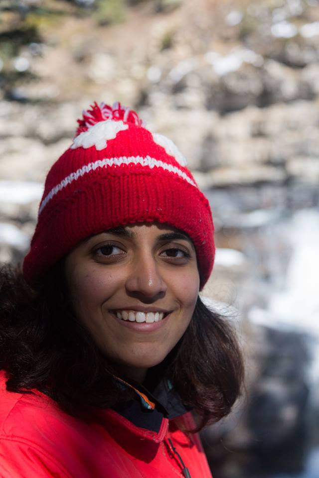

 

# Background 

I completed my bachelors and masters in Physics from the Indian Institute of Science, Education, and Research. For the duration of my undergraduate studies, I was supported by the <a href="http://www.kvpy.iisc.ernet.in/main/index.htm"> Kishore Vaigyanik Protsahan Yojana (KVPY)</a>. I was fortunate enough to be selected to the astronomy olympiad camp as high-school senior, which got me hooked on physics and astronomy. Also while at IISER, together with a wonderful group of motivated students, we started the monthly college publication, Sentience, which we ran for over 3 years.

