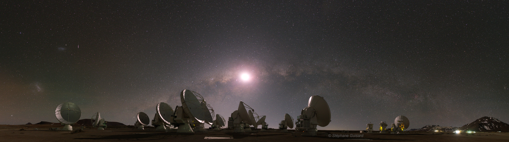
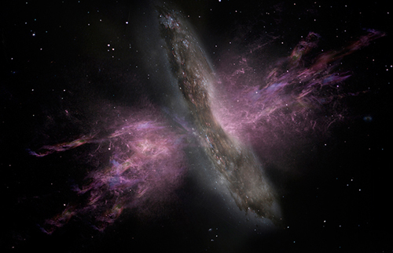
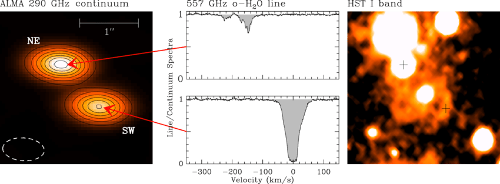
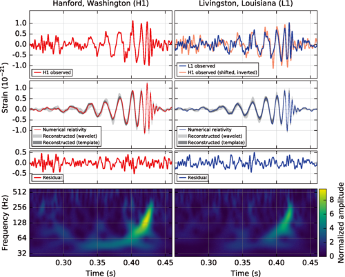

|  | 
|:--:| 
| A lot of my current research involves using the [Atacama Large (sub) Millimetre Array (ALMA)](https://almascience.nrao.edu/), pictured here with the Milky Way in the background.|

### Hearts of darkness
As a Visiting Graduate Research Fellow at the [Infrared Processing and Analysis Center (IPAC)](https://www.ipac.caltech.edu/), Caltech, I worked with Lee Armus and the [Great-Observatories All-sky Survey (GOALS)](http://goals.ipac.caltech.edu/) team on the study of some of the dustiest and most deeply obscured nuclei in the nearby universe. Using dense gas observations from ALMA, we study the the molecular gas dynamics on ~50-100 pc scales in the nuclei of these galaxies (paper to be posted soon!)

### The most powerful molecular outflows in the nearby universe
|  | 
|:--:| 
| An artist's impression of AGN-driven outflows |

Observations over the last decade have revealed that feedback in the form of molecular gas outflows is ubiquitous in local ultra luminous infrared galaxies (ULIRGs). Such outflows can clear the nuclear environments of gas and dust, quench star formation and active galactic nuclei (AGN) growth, and are a key step in the evolution of dust-obscured AGN to optically luminous quasars.In this work, we present multi-spectral line observations of feedback in the two most powerful molecular gas outflows in the local universe. We spatially resolve the outflows to determine their kinematics and structure and find that they can drive out the molecular gas and quench star formation within ~ few Myr. Applying mid-IR diagnostics to constrain the relative contributions of AGN and nuclear starburst activity, we find that starburst activity plays a significant role in driving the outflow. [Link to paper](https://ui.adsabs.harvard.edu/#abs/2018ApJ...859...35G/abstract)

### Dense molecular gas in the high-redshift universe 
We perfomed observations of dense molecular gas - which traces the actively-starforming molecular gas - in the high-redshift galaxy EGS 13004291 (z = 1.197) using the Plateau de Bure Interferometer, and tentatively detect HCN and HNC emission, as well as from the bulk of the molecular gas traced by CO emission. We find that the observed HCN emission is over-luminous with respect to both the CO and the IR luminosity, suggesting that turbulence may play a more important role in star-formation at high-redshift. [Link to paper](https://ui.adsabs.harvard.edu/#abs/2017ApJ...838..136G/abstract)

### A deep blind survey for molecular gas detection

| | 
|:--:| 
| Absorption lines from PKS1830-211 -a triply lensed system at z~ 0.89. Adapted from [Muller et al. 2014.](https://ui.adsabs.harvard.edu/#abs/2014A&A...566A.112M/abstract) |

Searching for absorption lines of molecular gas is a powerfun way to circumvent selection biases inherent in emission line studies of galaxies at high-redshift, while also allowing for a much more detailed study of the same. For my master's thesis project, I worked on a large-scale "blind" millimetre wavelength survey for redshifted molecular absorption in the CO/HCO+ rotational lines. I analysed observations of 549 radio-selected sources with the VLA in the Ka and Q bands (32- 48 GHz), covering the redshift range 0.85 < z < 2.60 and 2.72 < z < 4.57. I created a pipeline to search for absorption line features in the entire data set, returning a selection of candidate features at various levels of significance. Followup observations of the candidate absorption features revealed that no new molecular gas absorption systems had been detected, though we successfully detected all known systems included in the survey. 

### Enhancement of sensitivity of detection of gravitational waves from supernovae

| | 
|:--:| 
| The first gravitational wave signatures! Adapted from [here](https://journals.aps.org/prl/abstract/10.1103/PhysRevLett.116.061102)| 

A little before [astronomers detected gravitational waves in 2017](https://journals.aps.org/prl/abstract/10.1103/PhysRevLett.116.061102), I worked on enhancing sensitivity of the LIGO gravitational wave detection. Together with Prof. Soma Mukherjee at the Center for Gravitational Wave Research at the university of Texas, Brownsville, I developed a method based on first treating the GW data from the observatories with a Blind Source Separation (BSS) algorithm to enhance any signal that may be present and then subjecting the BSS-treated data to the network analysis for signal detection. The study was performed both with simulated data as well as data from the Laser Interferometric Gravitational Wave Observatory's (LIGO) fourth Science run (S4). Sine-Gaussian and Dimmelmeier-Font-Mueller (DFM) waveforms have been used in the study. It was seen that the sensitivity of the search pipeline steadily shows a better performance when the data is pre-treated with BSS.
